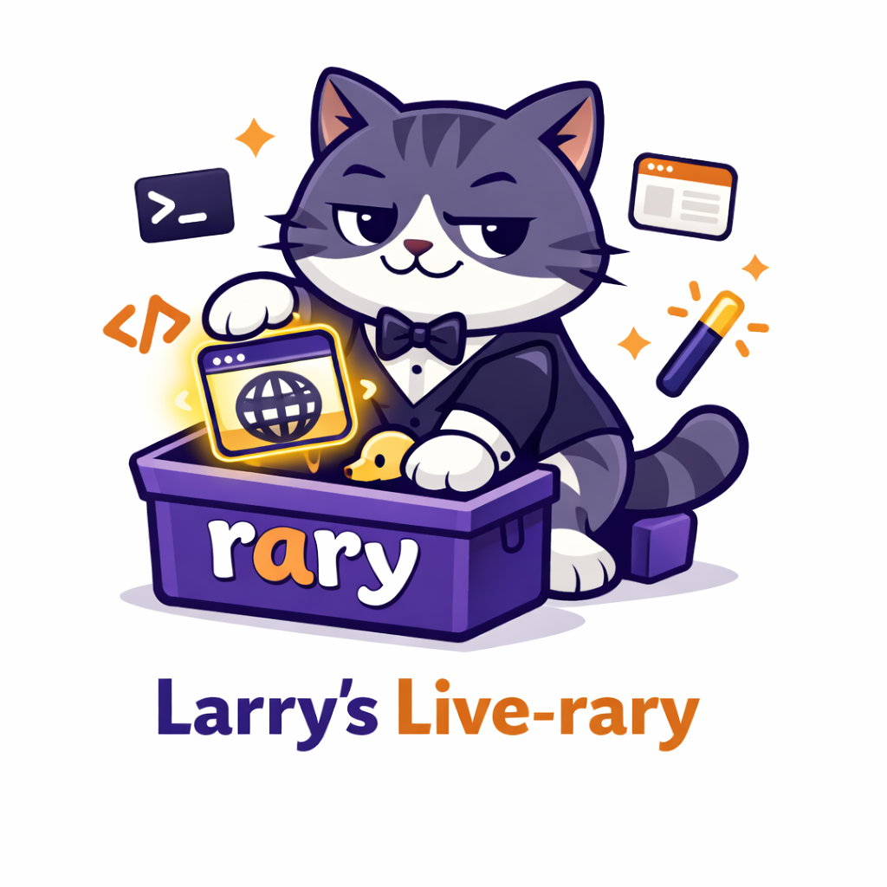

# pw-skill

Playwright CLI Skill for Claude Code. Persistent browser sessions, modular skills, token-efficient, full flow engine.

## Why not MCP?

| | MCP | pw-skill |
|---|---|---|
| Token cost | ~3,500+ tokens always loaded | ~850 tokens per skill, only when needed |
| Browser session | New browser per action | Persistent via CDP, named sessions |
| Session management | None | Named sessions with isolated profiles |
| Debug tools | None | Console, network, trace, video |
| Tab management | None | Full tab control |
| Flow engine | None | Sequence with variables, conditions, loops |
| CLI access | No | `pw` command (35+ subcommands) |

## Why CLI?

MCP gives tools to AI. CLI gives tools to everyone.

- Same command for humans and AI: `pw click "#btn"`
- Share the same browser session — real coworking
- Reproduce and debug by running the exact command yourself
- No protocol overhead, no server setup

## Install

Requires Node 18+.

### Claude Code Plugin (recommended)

```bash
/plugin marketplace add doubleg0re/pw-skill
/plugin install pw-skill@pw-skill
cd ~/.claude/plugins/marketplaces/pw-skill
npm run setup
```

This registers the Claude Code skills and installs the local npm dependencies used by the plugin checkout.
It does **not** add `pw` / `pwi` to your shell `PATH`.

### npm (CLI only)

```bash
npm install -g pw-skill
```

This installs the CLI only. It does not register the Claude Code skills by itself.

If you still want the skill-oriented guidance from the terminal, use:

```bash
pw agent skill --all
pw agent skill --browse
pw agent skill --launch
pw agent skill --test
pw agent skill --close
```

### Both (plugin + CLI)

```bash
/plugin marketplace add doubleg0re/pw-skill
/plugin install pw-skill@pw-skill
cd ~/.claude/plugins/marketplaces/pw-skill
npm run setup

npm install -g pw-skill
```

Use this when you want the Claude Code plugin **and** the `pw` / `pwi` shell commands.

### Local Editable Checkout (advanced)

```bash
git clone https://github.com/doubleg0re/pw-skill.git
cd pw-skill
npm run setup
```

This is mainly for hacking on the repo directly. If you also want the shell CLI on your `PATH`, run `npm install -g pw-skill` separately.

## Quick Start

```bash
# Launch a named browser session
pw launch --name=dev

# Navigate and interact
pw navigate http://localhost:3000 --screenshot
pw fill "#email" "admin@test.com"
pw fill "#password" "secret"
pw click "Sign in"
pw wait /dashboard

# Observe
pw screenshot --full
pw console dump

# Close when done
pw close --session=dev
```

## Choose Your Lane

If you just want to do something quickly, use `pwi`.

- `pwi` is the lightest entry point: launch, do the action, exit.
- Good for quick inspection, one-off clicks, screenshots, and tiny experiments.
- Handy aliases: `nav`=`navigate`, `shot`=`screenshot`, `sel`=`select`, `eval`=`evaluate`.

```bash
pwi nav https://example.com --screenshot
pwi dump --selector="h1" --text
```

If you want lightweight browser automation, use `pw seq|sequence`.

- `pw seq|sequence` is the next step up: structured multi-step runs with variables, branching, loops, and reusable flow files.
- Good when one-shot commands stop being enough, but you do not want to build extensions yet.

```bash
pw seq ./login-flow.json
pw seq '[{"nav":"https://example.com"},{"action":"click","args":["#login"]}]'
```

If you want advanced runtime behavior, use `rary`.

- `rary` is for extensions, hooks, event handlers, sidecars, and custom sequence actions.
- Use it when you want to grow beyond the built-in runtime and attach new capabilities to `pw`.

```bash
pw rary get <repo-or-path>
pw rary put <package-name>
```

## For Agents

If `pw-skill` is installed as a CLI but not registered as a Claude Code skill, the terminal can still print compact skill summaries:

```bash
pw agent skill --all
pw agent skill --browse
pw agent skill --launch
pw agent skill --test
pw agent skill --close
```

These are compact CLI-facing summaries of the `pw-browse`, `pw-launch`, `pw-test`, and `pw-close` skill docs.

## One-shot Mode (`pwi`)

`pwi` launches a temporary browser, executes the action(s), and exits. No sessions, no CDP server, no hooks, no extensions. Just Playwright directly.

```bash
# One-shot: launches browser → executes → closes
pwi navigate https://example.com --screenshot
pwi dump --selector="h1" --text
pwi navigate url :: click "#login" :: screenshot

# Options
pwi navigate url --headed          # show browser window
pwi navigate url                   # auto viewport (follow browser window)
pwi navigate url --viewport=800x600
```

No `pw launch` needed. For session-based persistent work, use `pw` instead.

| Command | Browser | Session | Hooks/Extensions |
|---------|---------|---------|------------------|
| `pwi action` | temporary, auto-closes | none | none |
| `pw action` | persistent via CDP | required | loaded |
| `pw a :: b` | persistent via CDP | required | loaded |

Chaining is restricted to browser actions only. Session, admin, and package commands (`launch`, `close`, `rary`, etc.) are not chainable.

## Extensions

pw-skill uses a lightweight extension system called `rary`. Extensions can add event handlers, hooks, and custom sequence actions. Official extensions live in [doubleg0re/pw-extensions](https://github.com/doubleg0re/pw-extensions).

```bash
# Install official extensions using builtin aliases (recommended)
pw rary get builtin:pw-monitor
pw rary get builtin:pw-user-action
pw rary get builtin:pw-ws-server

# Equivalent explicit repo syntax
pw rary get doubleg0re/pw-extensions//pw-monitor

# Activate
pw rary put pw-monitor

# Install with source preserved
pw rary get builtin:pw-monitor --source

# Install and build
pw rary get builtin:pw-monitor --source --build

# List
pw rary toybox

# Deactivate without removing
pw rary ignore <package-name>     # alias: snub
```

### Official Extensions

Builtin aliases resolve to packages in [doubleg0re/pw-extensions](https://github.com/doubleg0re/pw-extensions):

| Extension | Description |
|---|---|
| `pw-ws-server` | Transport-only WebSocket server. Loads providers declared by other extensions and relays `snapshot`/`event` messages per channel — no domain logic of its own |
| `pw-monitor` | Owns the `pw-monitor/v1` protocol: real-time tab/focus/visibility snapshots via a CDP sidecar + OS foreground detection. Publishes via pw-ws-server, exposes a consumer client API for other extensions |
| `pw-user-action` | Prompts the user to complete a manual step inside a flow. Uses a native Tauri/wry dialog (always-on-top, title + icon) and subscribes to `pw-monitor/v1` so the dialog hides when the browser loses focus or the user switches tabs |

### Extension dependency model

Extensions declare their relationships in `larry.json` using the nested `extension.*` fields:

```jsonc
// pw-user-action/larry.json
{
  "extension": {
    "dependencies": { "pw-monitor": "builtin:pw-monitor" },
    "consumes": { "protocols": ["pw-monitor/v1"] }
  }
}

// pw-monitor/larry.json
{
  "extension": {
    "dependencies": { "pw-ws-server": "builtin:pw-ws-server" },
    "provides": {
      "protocols": {
        "pw-monitor/v1": { "transport": "ws", "entry": "dist/provider.js" }
      }
    }
  }
}
```

`pw rary get` installs the dependency chain recursively, and `pw rary put` activates dependencies along with the target. `pw rary destroy` / `ignore` is blocked if active dependents exist (override with `--force`). So `pw rary get builtin:pw-user-action` installs the full chain, and `pw rary put pw-user-action` brings up `pw-ws-server -> pw-monitor -> pw-user-action` in one step.

### Extension dependencies in flows

Flows can also declare extensions they need at the flow level via `info.requiresRary`. This is checked before the flow runs and complements `extension.dependencies` (which covers package-level install/activation).

```json
{
  "info": {
    "name": "login-flow",
    "requiresRary": ["pw-monitor"]
  },
  "flow": [
    { "action": "navigate", "args": ["https://example.com/login"] }
  ]
}
```

Missing extensions fail fast with a clear error. CLI override: `pw sequence flow.json --rary=pw-monitor`.

## Execution Model

### pw vs pwi

| | `pw` | `pwi` |
|---|---|---|
| Browser | Persistent (CDP server, named session) | Temporary (launches, executes, closes) |
| Requires `pw launch` | Yes | No |
| Session management | Full (named, resumable, multi-session) | None |
| Extensions/hooks | Loaded every command | None |
| Use case | Ongoing work, complex flows | Quick one-shot tasks |

### Session Resolution (`pw` commands)

When you run a `pw` command, the session is resolved in this order:

1. **`--session=name`** — Explicit flag. If the named session doesn't exist or is dead, error.
2. **Bound session** — Via `pw use <name>`. If the bound session is dead, falls through.
3. **Auto-select** — If exactly one session is alive, use it.
4. **No session** — Auto-launches a new session.
5. **Multiple sessions** — Error: "Specify `--session=<name>` or run `pw use <name>`."

### Global Flags

| Flag | Where it applies | Effect |
|------|-----------------|--------|
| `--session=N` | `pw` commands only | Target a specific named session |
| `--tab=N` | `pw` commands only | Target a specific tab (default: 0) |
| `--headed` | `pw` and `pwi` | Show browser window |
| `--viewport=auto\|WxH` | `pw` and `pwi` | Use auto viewport by default, or set an explicit size |
| `--video[=name]` | `pw` commands only | Enable video recording |
| `--screenshot` | `pw` and `pwi` | Take screenshot after action |
| `--screenshot-path=dir` | `pw launch` | Pin session screenshots to a stable directory |
| `--no-restore` | `pw` commands only | Don't restore last URL on reconnect |

### What happens on each `pw` command

```
pw navigate url
 │
 ├─ 1. Session resolution (see above)
 ├─ 2. CDP reconnect (reuses existing browser/page/DOM)
 ├─ 3. --tab selection (if specified)
 ├─ 4. Load extension event handlers
 ├─ 5. Build runtime context (session, page, tabId, emitEvent)
 ├─ 6. Run extension load hooks (e.g., pw-monitor tab sync)
 ├─ 7. Execute the action
 └─ 8. Output JSON result
```

### What happens on each `pwi` command

```
pwi navigate url
 │
 ├─ 1. chromium.launch() — temporary browser
 ├─ 2. Execute the action(s)
 ├─ 3. Output JSON result
 └─ 4. browser.close() — browser gone
```

### Error & Recovery

| Situation | Behavior |
|-----------|----------|
| `--session=ghost` (doesn't exist) | Error: "Session not found" |
| `--session=dead` (PID dead) | Error: "Session not running" |
| Bound session died | Falls through to auto-select |
| No sessions at all | Auto-launches a new one |
| CDP reconnect fails | Tries WebSocket fallback |
| Session profile exists but no session.json | `pw launch --resume=name` to restart |

## Session Management

Sessions are the core of pw-skill. Each session is a named, persistent Chromium process with its own user-data directory stored globally at `~/.playwright-state/sessions/`.

```bash
# Launch a named session
pw launch --name=dev
pw launch --name=staging --headed

# Resume a previous session (reuses cookies, localStorage, profile)
pw launch --resume=dev

# Bind a session to the current project
pw use dev

# List all sessions (shows name, port, pid, status)
pw sessions

# Close a specific session
pw close --session=dev

# Close all sessions
pw close --all
```

Session resolution order:
1. Explicit `--session=name` flag on any command
2. Bound session via `pw use`
3. Auto-select if only one session is alive

Multiple sessions can run simultaneously. Each gets isolated user-data, so login state and cookies never bleed between sessions.

## CLI Reference

Cheatsheet for the most common commands. **Full reference**: [docs/CLI-REFERENCE.md](docs/CLI-REFERENCE.md) or `pw help`.

```bash
# Session lifecycle
pw launch [url] [--name=N]        # Start / reconnect a session
pw use <name>                     # Bind session to current project
pw sessions                       # List sessions
pw close [--session=N]            # Close bound session

# Navigation & interaction
pw nav <url>                      # (alias: navigate)
pw click <selector|text|x,y>
pw fill <selector> <text>
pw submit [selector] [--wait=/url]
pw scroll <up|down|top|bottom|selector|px>
pw resize <width>x<height>

# Observation
pw shot [selector|--full]         # (alias: screenshot)
pw find <selector>
pw attr <selector> <name>
pw eval '<js>'
pw wait <ms|selector|/url|HH:MM>

# HTTP (authenticated via browser cookies)
pw fetch GET|POST|PUT|DELETE|PATCH <path> [body]

# Automation
pw run scripts/playwright/login.ts
pw sequence <json-file>           # Flow engine — see Sequence Flow Engine below

# Debugging capture
pw console inject | dump | tail | clear
pw network inject | dump | find | clear
pw trace  start | stop | view | status
pw video  list | path | rename | clear
pw status
```

### Global Flags

```
--session=N         Target specific session
--tab=N             Target specific tab (default: 0)
--headed            Show browser window
--viewport=auto|WxH Viewport size (default: auto)
--video[=name]      Enable video recording
--raw               Bypass truncation/masking in console/network dump
```

> **Caution for AI agents:** Avoid `pw close --all` unless explicitly asked. Prefer plain `pw close` to only terminate the current bound session.

## Sequence Flow Engine

Sequence is a full flow engine that runs JSON action lists with variables, branching, loops, reusable functions, and structured error handling.

```bash
pw sequence ./login-flow.json
pw sequence flow.json --params ./params/prod.json
pw sequence flow.json --allow-shell --rary=pw-monitor
```

**Supported primitives**: `set`, `condition`, `each`, `loop`, `label` / `goto`, `def` / `call`, `try` / `catch` / `finally`, `wait` (time, observation, `user-action`, `user-alert`), `shell`, `log`, plus all browser actions.

**Variables**: `out` stores action results; `{{var}}` interpolates them. Special registers include `{{$ret}}`, `{{$err}}`, `{{$code}}`, `{{$elem}}`, `{{$index}}`, `{{$key}}`, `{{$error}}`, `{{$errorType}}`.

Minimal example:

```json
[
  {"action": "navigate", "args": ["http://localhost:3000"]},
  {"action": "fetch", "args": ["GET", "/api/user"], "out": "user"},
  {"action": "condition", "ref": "user.role", "eq": "admin",
   "then": [{"action": "navigate", "args": ["/admin"]}],
   "else": [{"action": "navigate", "args": ["/dashboard"]}]}
]
```

**Full syntax reference**: [docs/SEQUENCE-SYNTAX.md](docs/SEQUENCE-SYNTAX.md) — covers every primitive, args/params formats, validation rules, and edge cases. Also available from the terminal via `pw help seq`.

## Debugging

pw-skill gives you everything you need to diagnose a failed run without rerunning it:

- **Trace** — Playwright traces with screenshots, DOM snapshots, and network (`pw trace start ... stop ... view`).
- **Video** — per-session video recording, enabled by `--video[=name]` on any command. Auto-saved and renamed on `pw close`.
- **Console / Network capture** — patches browser globals so logs survive CDP reconnects (`pw console inject`, `pw network inject`). Dumps support include/exclude filters (`+foo`, `-bar`, `/regex/`) and a `--raw` escape hatch.
- **Sensitive-data masking** — auth headers (`authorization`, `cookie`, `set-cookie`, `x-api-key`, `x-auth-token`) and JSON fields (`password`, `token`, `secret`, `api_key`, `access_token`, `refresh_token`) are automatically masked. Use `--raw` to bypass when you really need the raw output.
- **Error context on failure** — every failed command auto-captures the current URL, page title, active tab, session name, and an error screenshot into `.playwright-state/screenshots/`.

See the [CLI Reference](docs/CLI-REFERENCE.md) for the full command list.

## Package Management (rary)

<p align="center">
  
</p>

Larry the Cat's package and extension ecosystem. Install, inspect, activate, and manage browser add-ons.

```bash
# Install a package
pw rary get builtin:pw-user-action
pw rary yoink builtin:pw-user-action   # Alias for get
pw rary get ./local-package

# Inspect
pw rary toybox            # List installed packages
pw rary peek <package>    # Show package details

# Activate/deactivate extensions
pw rary put <package>     # Activate extension (runs hooks on launch/close)
pw rary ignore <package>  # Deactivate without removing
pw rary snub <package>    # Alias for ignore

# Setup and maintenance
pw rary rolling <package> # Run first-time setup
pw rary need-repair       # Check for broken packages
pw rary destroy <package> # Remove package (alias: kick)
```

Packages live in `~/.playwright-state/toybox/`. Each package has a `larry.json` manifest defining commands, hooks (launch/load/close), and setup entries.

Extension hooks integrate with session lifecycle:
- `launch` hooks run after `pw launch`
- `close` hooks run before `pw close`

## Custom Scripts

Write project-specific scripts in `scripts/playwright/`. `pw run` checks that directory first for bare names:

```typescript
// scripts/playwright/login.ts
import { chromium } from 'playwright';

const browser = await chromium.connectOverCDP('http://localhost:9222');
const page = browser.contexts()[0].pages()[0];

await page.goto('http://localhost:3000/login');
await page.locator('#email').fill('admin@test.com');
await page.locator('#password').fill('password');
await page.locator('button[type="submit"]').click();
await page.waitForURL('**/dashboard');

console.log(JSON.stringify({ success: true, url: page.url() }));
```

```bash
pw run login.ts
pw run scripts/playwright/login.ts --session=dev
```

`pw run` looks in `scripts/playwright/` first for bare names like `login.ts`, but also accepts explicit relative or absolute paths.

## Architecture

### State layout

```
~/.playwright-state/              # Global, shared across projects
  sessions/<name>/
    session.json                  # pid, port, cdpEndpoint, startedAt, video
    user-data/                    # Chromium profile (persists across resume)
  toybox/<package>/
    larry.json                    # Package manifest
  extensions.json                 # Active extension registry

<project>/.playwright-state/      # Local, per-project
  current-session.txt             # Bound session name (via pw use)
  state.json                      # storageState
  screenshots/ videos/ traces/
  console.log  network.log
```

### Core vs extensions

The **core** is intentionally thin — it owns browser/session lifecycle, the Runtime Context SDK, and the event bridge. Heavier runtime features (persistent monitors, CDP sidecars, GUI overlays, WebSocket transports, native dialogs) live in **rary extensions**, not the core.

- `core` = thin runtime platform
- `extensions` = optional runtime products layered on top

See [Core and Extension Runtime Guide](docs/CORE-AND-EXTENSION-RUNTIME-GUIDE.md) for the full split.

### Key design decisions

- **Persistent browser with DOM state**: Chromium stays alive via `launchServer` + CDP. On reconnect the existing context and page are reused — scroll position, JS variables, in-progress form data all preserved. Cookies/localStorage persist via `storageState`.
- **Global sessions, local artifacts**: Session processes and profiles live in `~/.playwright-state/`; screenshots, logs, traces, and bindings are per-project.
- **Shared action module**: `actions.ts` is a single implementation used by both CLI scripts and the sequence engine — no duplication.
- **Safe arg passing**: CLI uses `spawnSync` with argument arrays, never shell string concatenation.
- **Modular skills**: Only the relevant Claude Code skill loads into the agent's context. Zero tokens when idle.
- **Browser auth in HTTP**: `pw fetch` / `pw submit` use the live browser's cookies, so API calls are authenticated automatically.
- **Whitelist security redaction**: Console/network dumps mask auth headers and common secret JSON fields by default. `--raw` to bypass.
- **File-based locking**: Cross-process session locks with stale detection (5min TTL), heartbeat for long ops, atomic JSON writes. Works on Windows (`taskkill`) and Unix.
- **Extension Runtime SDK**: `ExtensionRuntimeContext` hands extensions session info, `cdpEndpoint`, `emitEvent()`, lazy browser/page access, and `registerCleanup()`. Extensions can register custom sequence actions, event handlers, and background monitors without bloating the core.
- **Custom sequence actions**: Active extensions register actions in `larry.json` that become first-class DSL verbs. Custom action names must include a hyphen (e.g. `pw-user-action`) to stay visually distinct. Per-run merged map, built-in collision rejection.
- **Stable tab events**: `TAB_EVENTS` constants with a canonical `TabEventPayload` so core and extensions share one contract.
- **Flow-level dependencies**: Flows declare required extensions via `info.requiresRary`, checked before the flow runs. Complements the package-level `extension.dependencies` chain.
- **DI stores**: Session and rary stores use a factory pattern (`createSessionStore`, `createRaryStore`) for test isolation.
- **Standardized result schema**: Every environment-dependent operation emits a `warnings: string[]` array and consistent status fields.

## Tests

426 tests across 20 files (vitest), covering session management, sequence flow engine (incl. `requiresRary` / `extension.dependencies` resolution), variable interpolation, console/network filtering, action dispatch, rary store operations + dependency install/activation chains, file locking, error result assembly, connect edge cases, runtime SDK, tab sync, and settings.

```bash
npm test           # run all tests
npm run test:watch # watch mode
```

## License

MIT
